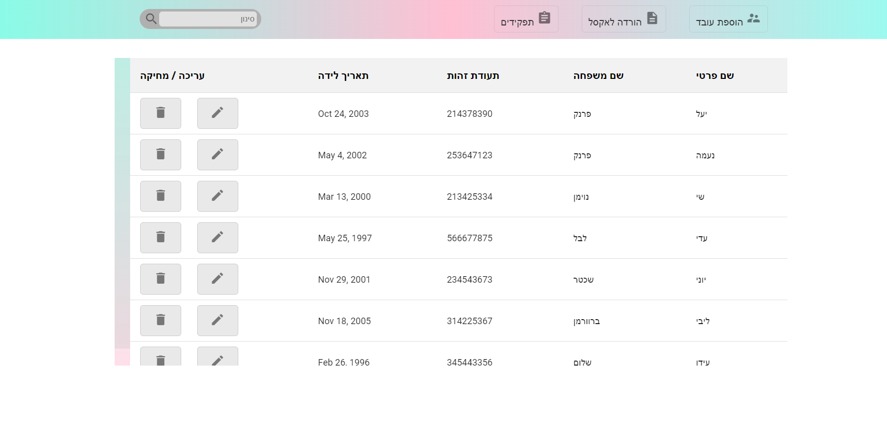
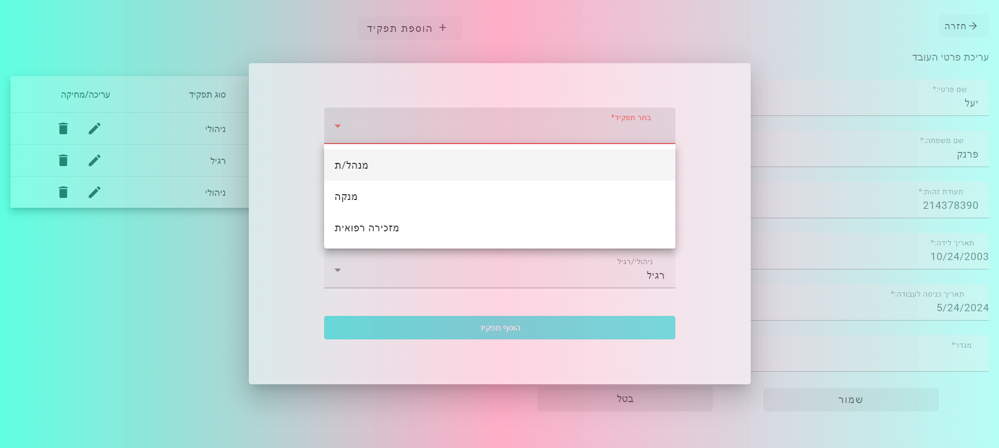

# Employees Management System

This project is a simple Employees Management System built with Angular.

## Demo

Check out the live demo of the project [here](https://employees--management.web.app/).

## Development Server

To run the project locally, follow these steps:

1. Install Node.js and npm (if not already installed).
2. Clone this repository to your local machine:
git clone <[repository_url](https://github.com/yulifrank/Employees-Management-Client.git)>

3. Navigate to the project directory in your terminal/command prompt.
4. Run `npm install` to install project dependencies.
5. Run `ng serve` for a development server.
6. Navigate to `http://localhost:4200/` in your web browser.
7. The application will automatically reload if you make any changes to the source files.

## Code Scaffolding

You can generate new components, directives, pipes, services, classes, guards, interfaces, enums, or modules using Angular CLI:

- To generate a new component: `ng generate component component-name`
- To generate other Angular elements, replace `component-name` with the desired type.

## Building

To build the project for production, run `ng build`. The build artifacts will be stored in the `dist/` directory.

## Running Unit Tests

To run unit tests using Karma, run `ng test`.

## Running End-to-End Tests

To run end-to-end tests using a platform of your choice, run `ng e2e`. Note that you need to add a package that implements end-to-end testing capabilities.

## Screenshots

Here are screenshots of some pages in the application:

*Home Page: Displays the employee table.*

*Roles Page: Shows the list of roles and allows adding new roles.*

*Edit Employee Page: Allows editing employee details.*

## Further Help

For more help on using the Angular CLI, you can run `ng help` in your terminal/command prompt, or you can visit the [Angular CLI Overview and Command Reference](https://angular.io/cli) page.
